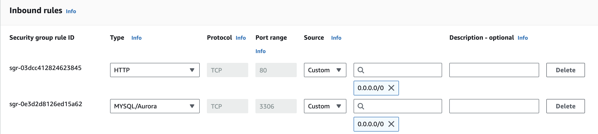

## Lab 162 Challenge : Launch an Amazon RDS DB instance using either Amazon Aurora Provisioned DB or MySQL database engines


## 1. Adding a new rule to the security group allow connecting to the database, since the default for security groups is to deny access: 

### connect to a DB instance using the MySQL command-line client :
>  mysql -h main-instance-1.123456789.us-west-2.rds.amazonaws.com -P 3306 -u admin -p


## 2. Creating a new database to hold the table :
```
CARETA DATABASE aws;

 CREATE TABLE restart (
    -> StudentId INT AUTO_INCREMENT PRIMARY KEY,
    -> StudentName VARCHAR(50),
    -> RestarCity VARCHAR(20),
    -> GraduationDate DATE
    -> );

```


## 3. Inserting values to the table :
- Single INSERT : 


- Multiple entries at ones:
> INSERT INTO restart (StudentName,RestarCity,GraduationDate)
    -> VALUES
    -> ('Marc','London','2024-07-24'),
    -> ('Adam','Coventry','2024-07-24'),
    -> ('Moe','Birmingham','2024-07-24'),
    -> ('Jane','London','2024-07-24'),
    -> ('Dee','Birmingham','2024-07-24'),
    -> ('Lee','Covetry','2024-07-24'),
    -> ('Sarah','Rugby','2024-07-24');


## restart Table after inserting 10 rows(Records):

 #### now if you noticed there are few things need to be corrected in this table. 

## - Fixing a Column title and a record entrie :
- This line will fix the typo in the column title :
> ALTER TABLE aws.restart RENAME COLUMN RestarCity TO RestartCity;

- This line will fix the error in the first row under the date column:
> UPDATE aws.restart SET GraduationDate = '2024-07-24' WHERE StudentName='Sultan'; 


## 4. Create a table CLOUD_PRACTITIONER
```
CREATE TABLE cloud_practitioner(
    StudentId INT,
     FOREIGN KEY (StudentId) REFERENCES restart(StudentId), 
     CertificationDate DATE );
```
By using a FOREIGN KEY we are connecting the to table to be able to join values 

First will add the Id from the first table into the second one : 
> INSERT INTO cloud_practitioner(StudentId)
SELECT StudentId FROM restart
LIMIT 5;
- And then :
UPDATE cloud_practitioner
SET CertificationDate = '2024-07-25';

Helpful Delete Commands :
> DELETE FROM cloud_practitioner LIMIT 4;

> DELETE FROM cloud_practitioner WHERE StudentId='1';
 ### cloud_practitioner table after inserting : 


## 5. Performing an inner JOIN to display student ID, Student Name, Certification Date:

> SELECT restart.StudentId, restart.Studentname, cloud_practitioner.CertificationDate
FROM restart
INNER JOIN cloud_practitioner ON restart.StudentId = cloud_practitioner.StudentId;

## The Final result with INNER JOIN :

